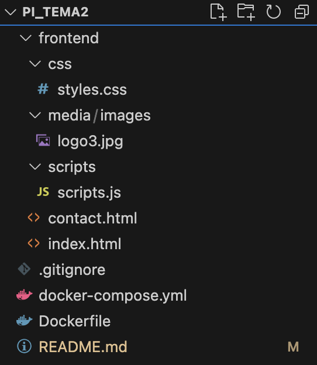
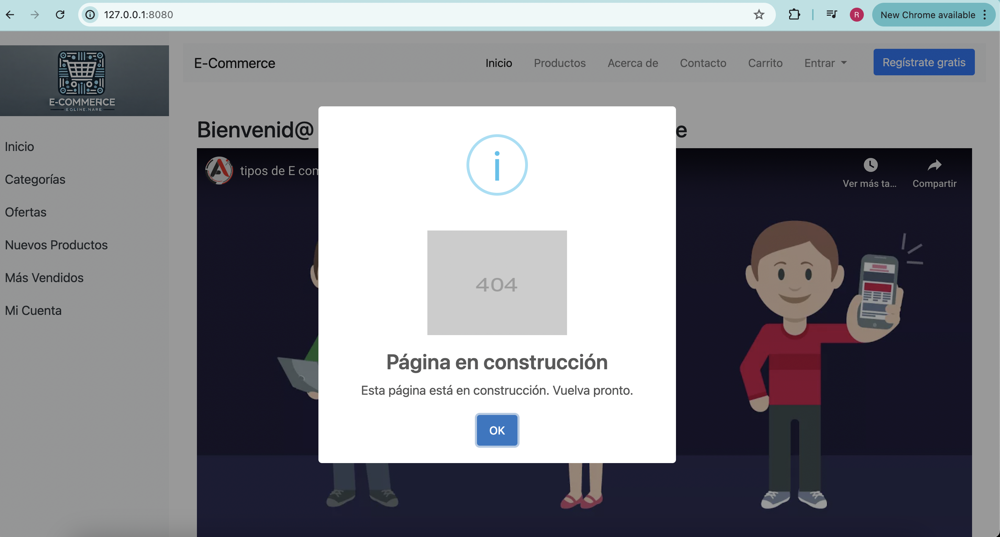
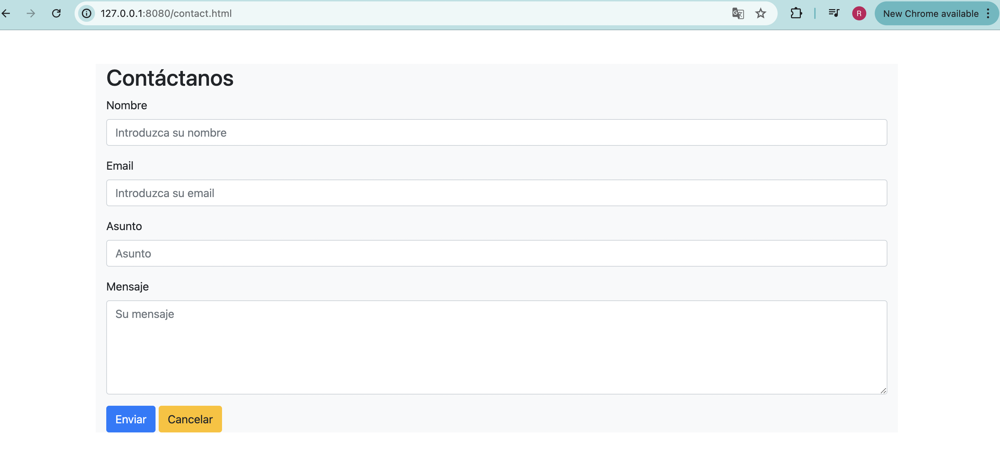
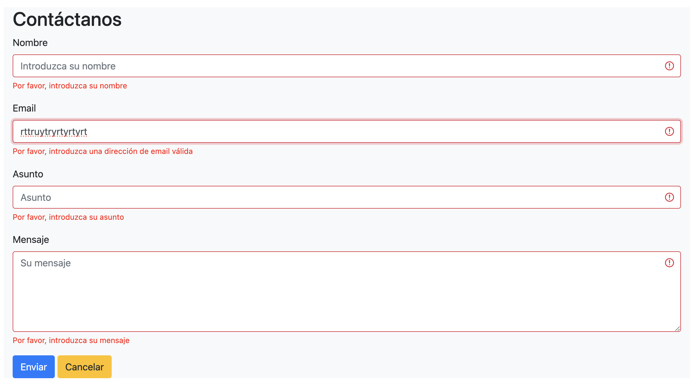

# Plataforma de E-Commerce

¡Bienvenido a la Plataforma de E-Commerce! Este proyecto está construido utilizando HTML, CSS, Bootstrap y JavaScript para el frontend, y está contenedorizado utilizando Docker y Docker Compose.

## Tabla de Contenidos

- [Instalación](#instalación)
  - [Instalando Docker Compose](#instalando-docker-compose)
    - [Windows](#windows)
    - [macOS](#macos)
    - [Linux](#linux)
- [Ejecutar los Servicios](#ejecutar-los-servicios)
- [Estructura del Proyecto](#estructura-del-proyecto)
- [Tecnologías usadas](#tecnologías-usadas)
- [Descripción del Proyecto](#descripción-del-proyecto)

## Instalación

### Instalando Docker Compose

#### Windows

1. **Instalar Docker Desktop**:
   - Descarga e instala Docker Desktop desde [Docker Hub](https://www.docker.com/products/docker-desktop).
   - Sigue las instrucciones de instalación y asegúrate de que Docker Desktop esté ejecutándose.

2. **Verificar la Instalación**:
   - Abre el Símbolo del sistema (cmd) o PowerShell.
   - Ejecuta el siguiente comando para verificar la instalación:
     ```sh
     docker-compose --version
     ```

#### macOS

1. **Instalar Docker Desktop**:
   - Descarga e instala Docker Desktop desde [Docker Hub](https://www.docker.com/products/docker-desktop).
   - Sigue las instrucciones de instalación y asegúrate de que Docker Desktop esté ejecutándose.

2. **Verificar la Instalación**:
   - Abre la Terminal.
   - Ejecuta el siguiente comando para verificar la instalación:
     ```sh
     docker-compose --version
     ```

#### Linux

1. **Instalar Docker**:
   - Sigue las instrucciones para instalar Docker desde [la documentación oficial de Docker](https://docs.docker.com/engine/install/).

2. **Instalar Docker Compose**:
   - Ejecuta los siguientes comandos para descargar e instalar Docker Compose:
     ```sh
     sudo curl -L "https://github.com/docker/compose/releases/download/1.29.2/docker-compose-$(uname -s)-$(uname -m)" -o /usr/local/bin/docker-compose
     sudo chmod +x /usr/local/bin/docker-compose
     ```

3. **Verificar la Instalación**:
   - Ejecuta el siguiente comando para verificar la instalación:
     ```sh
     docker-compose --version
     ```

## Ejecutar los Servicios

Una vez que Docker Compose esté instalado, sigue estos pasos para iniciar los servicios:

1. **Clonar el Repositorio**:
   ```sh
   git clone https://github.com/rcglezreyes/pi_tema2.git
   cd pi_tema2
   ```
2. **Ejecución del sistema**:

Para levantar el sistema en ambiente docker solo tiene que ejecutar este comando desde la carpeta de la aplicación:
   ```sh
   docker-compose up -d --build
   ```
Para detener el servicio:
   ```sh
   docker-compose down
   ```
Finalmente accediendo a la URL: ```http://127.0.0.1:8080/``` o ```http://127.0.0.1:8080/index.html``` puede levantar la aplicación en ambiente docker

3. **Ejecución del sistema (sin usar Docker)**:
Puede igual ir directo a la carpeta del repositorio descargado, dentro de esta a la subcarpeta ```frontend``` y dar doble click en el archivo ```index.html```, y levantará la aplicación en ambiente local.

## Estructura del proyecto



En la carpeta ```scripts``` están los script de JS

## Tecnologías usadas

Lenguajes de Programación: HTML5 y Javascript
Estilos: CSS
Frameworks y LIbrerías: Bootstrap 4.5, JQuery 3.5, Jquery Validator, Sweetalert (Swal)


## Descripción del proyecto


Esta es nuestra página de inicio ```index.html```, cuenta con varias opciones, tanto en el menú lateral, como en el superior.


Se ha usado la librería Swal2 de JS para mostrar aquellos links que todavía no tienen html diseñado.


Se muestra un formulario de HTML con Bootstrap para salvar los datos del contacto


Se ha construido un formulario estilo dropdown para el login, aqui vemos el ejemplo de los mensajes de error luego de la validación usando la librería de JQuery Validator


Otro ejemplo de validaciones de campos de formularios usando la misma librería